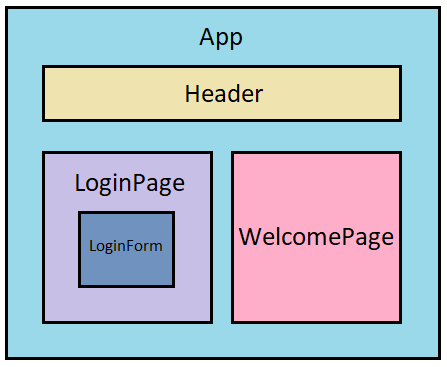

# React Testing Example  
  
 

 
  
 
Source code of Medium Articles which describes how to apply component driven and test driven development approaches in React + Redux apps to achieve flexible architecture and 100% code coverage:  

- [Test React Apps as a Pro. Part 1](https://medium.com/@p.mazhnik/test-react-apps-as-a-pro-part-1-f5e10ae0b41b)

## Main Libraries Used 🛠

- [Create React App](https://create-react-app.dev/)
- [Storybook ](https://storybook.js.org/docs/react/get-started/introduction)
- [Enzyme](https://github.com/enzymejs/enzyme)
- [Jest](https://jestjs.io/)  
- [Material-UI ](https://material-ui.com/) 

## Project structure 🧱

## Available Scripts 👨‍💻

In the project directory, you can run:

### `yarn run storybook`

Runs storybook.

### `yarn test`

Launches the test runner. 

### `yarn run test:coverage`  

Launches the test runner and generates coverage report.  

### `yarn start`

Runs the app in the development mode. 
Open [http://localhost:3000](http://localhost:3000) to view it in the browser.

The page will reload if you make edits. 
You will also see any lint errors in the console.

### `yarn build`

Builds the app for production to the `build` folder. 
It correctly bundles React in production mode and optimizes the build for the best performance.

The build is minified and the filenames include the hashes. 
Your app is ready to be deployed!

See the section about [deployment](https://facebook.github.io/create-react-app/docs/deployment) for more information.

## Learn More 📖

To learn Storybook, check out the [Storybook documentation](https://storybook.js.org/docs/react/get-started/introduction).  
To learn React, check out the [React documentation](https://reactjs.org/).

